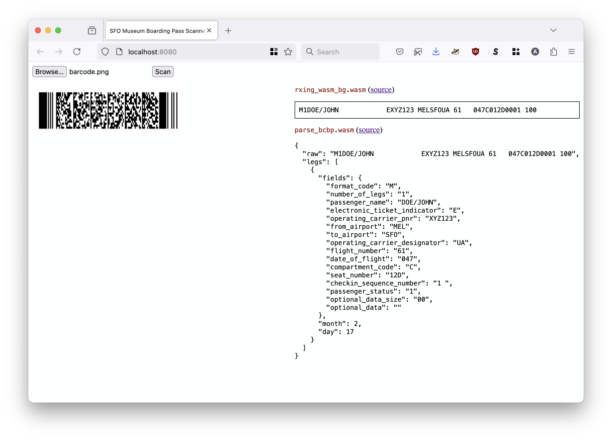

# www-sfomuseum-boardingpass

Demonstration website to test WebAssembly (WASM) binaries from the [sfomuseum/rs-rxing-wasm](https://github.com/sfomuseum/rs-rxing-wasm) and [sfomuseum/go-bcbp-wasm](https://github.com/sfomuseum/go-bcbp-wasm) packages to decode and parse boarding pass barcodes.

## Example

```
$> make debug
fileserver \
		-root ./www \
		-server-uri http://localhost:8080 \
		-mimetype js=text/javascript \
		-mimetype wasm=application/wasm \
		-enable-cors
2025/02/21 14:38:30 Serving ./www and listening for requests on http://localhost:8080
```

For example:



## See also

* https://github.com/sfomuseum/rs-rxing-wasm
* https://github.com/sfomuseum/go-bcbp-wasm
* https://github.com/sfomuseum/go-bcbp